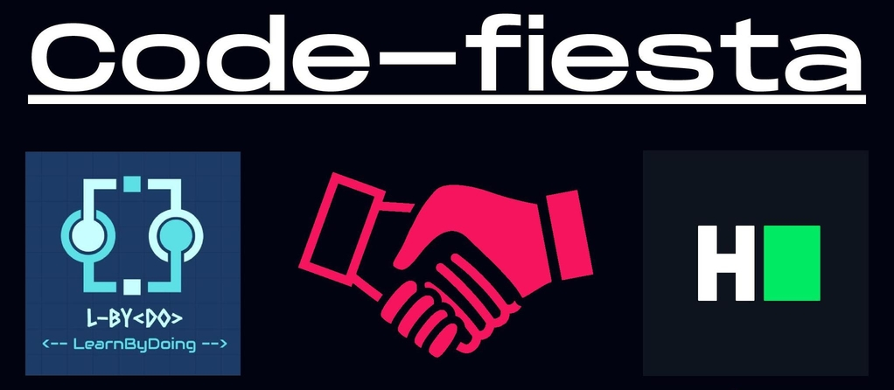

    
     
    
    
    
    
    

# CODE-FIESTA- 1.0 

## Contest Outline
This contest had been organized by L-ByDo on HackerRank as a part of our initiative of Learning By Doing on [28 June 2020]()

There were 4 questions {Easy:1, Medium:2, Difficult:1}, curated by the Community Facilitators:

* [Json's Gems](https://www.hackerrank.com/contests/code-feista-1-0/challenges/jsons-gems)  
* [Flag Hills](https://www.hackerrank.com/contests/code-feista-1-0/challenges/flag-hills)  
* [The Diwali Shopping](https://www.hackerrank.com/contests/code-feista-1-0/challenges/the-diwali-shopping)
* [The Mathematical Signboard](https://www.hackerrank.com/contests/code-feista-1-0/challenges/the-mathematical-signboard)          

## Repo Overview

This repository is made for uploading solutions for the contest questions in multiple languages.
Issues have been opened for anyone who wants to contribute the solutions in some language or want to improve the existing ones.

## Contibuting Guidelines🌟

**Developer's time is of utmost importance!**✔️

* To work on an issue, comment on the issue so that the repo maintainers can assign them.
* Don't make a pull reques tuntil you have been assigned an issue, though you can work on an issue and make a comment later on the issue.
* If you have some idea or doubt, create an issue and it will be assigned to you once reviewed.
* To contribute, 
    * Fork the repo
    * Clone the forked repo
    * Add/Upload the changes
    * Push them and make a pull request
* For learning about issues and PR, check these links
    * [Issues](https://guides.github.com/features/issues/)
    * [Pull Requests](https://help.github.com/en/github/collaborating-with-issues-and-pull-requests/creating-a-pull-request)
    

